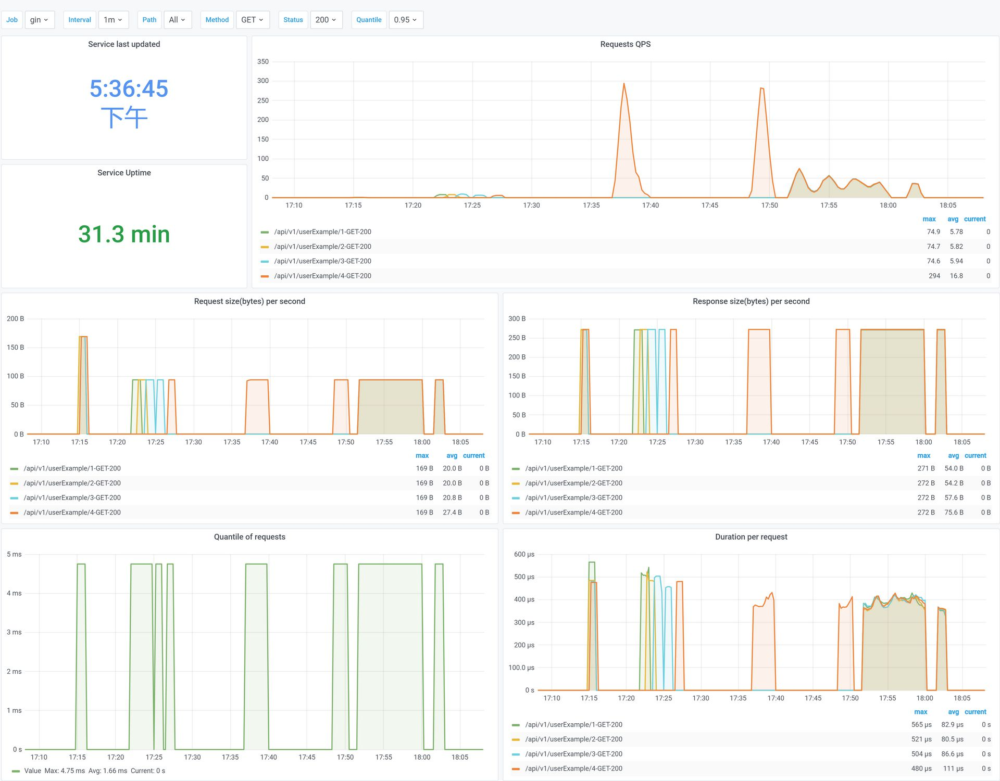

## metrics

gin metrics library, collect five metrics, `uptime`, `http_request_count_total`, `http_request_duration_seconds`, `http_request_size_bytes`, `http_response_size_bytes`.

<br>

### Example of use

```go
	import "github.com/go-dev-frame/sponge/pkg/gin/middleware/metrics"

	r := gin.Default()

	r.Use(metrics.Metrics(
		r,
		//metrics.WithMetricsPath("/demo/metrics"), // default is /metrics
		metrics.WithIgnoreStatusCodes(http.StatusNotFound), // ignore status codes
		//metrics.WithIgnoreRequestMethods(http.MethodHead),  // ignore request methods
		//metrics.WithIgnoreRequestPaths("/ping", "/health"), // ignore request paths
	))
```


<br>

### Metrics

Details about exposed Prometheus metrics.

| Name | Type | Exposed Information |
| ---- | ---- | ---------------------|
| gin_uptime						| Counter	| HTTP service uptime. |
| gin_http_request_count_total		| Counter	| Total number of HTTP requests made. |
| gin_http_request_duration_seconds | Histogram | HTTP request latencies in seconds. |
| gin_http_request_size_bytes 		| Summary	| HTTP request sizes in bytes. |
| gin_http_response_size_bytes 		| Summary	| HTTP response sizes in bytes. |

<br>

### Grafana charts

import [gin_grafana.json](gin_grafana.json) to your grafana, datasource name is `Prometheus`, change the name of the datasource according to your actual datasource.


