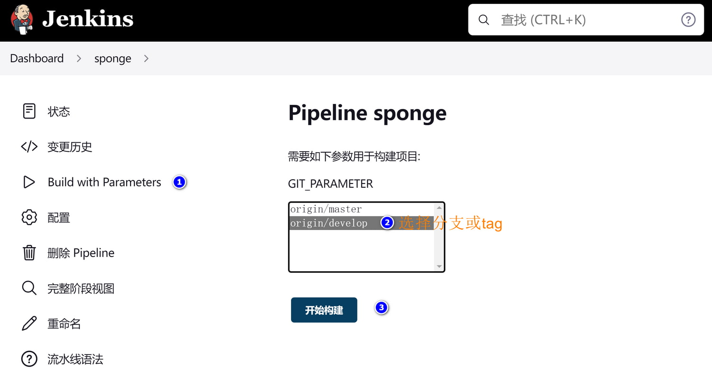

### 1 构建jenkins-go

构建镜像：

> docker build -t zhufuyi/jenkins-go:2.37 .

推送到镜像仓库

```shell
# 登录镜像仓库，如果是私有镜像仓库，指定地址
docker login -u username

docker push zhufuyi/jenkins-go:2.37
```

<br>

### 2 运行jenkins-go

启动jenkins服务：

> docker-compose up -d

在浏览器访问 `http://<地址>:38080`，第一启动需要初始管理员密码(通过命令`docker exec jenkins-go cat /var/jenkins_home/secrets/initialAdminPassword`获取)。

<br>

### 3 配置jenkins

登录之后安装插件，如果暂时不清楚需要哪些插件，点击安装推荐插件。

**创建管理员账号**

例如 admin 123456

<br>

**安装需要的插件**

点击【Manage Jenkins】-->【Manage Plugins】--> 【Available Plugins】，分别安装下面插件：

```bash
# 中文插件
Locale

# 添加参数化构建插件
Extended Choice Parameter

# 添加git参数插件
Git Parameter

# 账号管理
Role-based Authorization Strategy
```

重启jenkins服务，使插件生效。

<br>

**配置全局参数**

dashboard --> 系统管理 --> 系统配置 --> 勾选环境变量

设置容器镜像的仓库地址

```bash
# 添加环境变量
PATH
/opt/java/openjdk/bin:/usr/local/sbin:/usr/local/bin:/usr/sbin:/usr/bin:/sbin:/bin:/opt/go/bin

# 开发环境镜像仓库
DEV_REPO_HOST
示例dev.host.docker.com

# 生产环境镜像仓库
TEST_REPO_HOST
示例test.host.docker.com

# 生产环境镜像仓库
PROD_REPO_HOST
示例prod.host.docker.com
```

<br><br>

### 4 使用jenkins部署服务

比较简单的配置Jenkins任务方法：新建任务的时候导入已有的模板(填写已经存在的任务名称)，然后修改git仓库地址。如果没有模板，创建新任务步骤如下：

**(1) 创建新的jenkins任务**


<br>

**(2) 设置参数化构建**，参数名字为`GIT_PARAMETER`，如下图所示：


<br>

**(3) 设置流水线信息**，如下图所示：


<br>

**(4) 构建项目**，点击左边菜单栏Build with Parameters，选择对应的参数构建，如下图所示：



注：在构建之前，修改钉钉或邮件通知目标，方便查看构建部署结果，打开代码仓库下的Jenkinsfile文件，找到字段tel_num，填写手机号码。

<br><br>

### 5 推送镜像到镜像仓库的授权设置

在执行脚本image-push.sh之前，在jenkins-go容器先要取得镜像仓库的授权，不同镜像仓库授权方式可能不大一样。

**私有docker镜像仓库授权**

```bash
docker login <ip:端口>
# 账号
# 密码
```

<br>

**harbor镜像仓库授权**

```bash
# (1) docker登录harbor
docker login <ip:端口>
# 账号
# 密码

# (2) 如果harbor使用私有http证书，把授权密钥放在docker的certs.d文件中，例如文件路径如下：
/etc/docker/certs.d/<ip>/<ip>.crt
```

<br><br>

### 6 部署服务拉取镜像仓库的授权设置

在k8s部署服务拉取镜像需要授权时，需要额外创建一个`Secret`，为了拉取镜像时登录使用。

创建Secret方式一：

```bash
kubectl create secret docker-registry docker-auth-secret \
    --docker-server=DOCKER_REGISTRY_SERVER \
    --docker-username=DOCKER_USER \
    --docker-password=DOCKER_PASSWORD \
    --docker-email=DOCKER_EMAIL
```

创建Secret方式二(推荐)：在当前已经登录镜像仓库的docker主机中创建

```bash
kubectl create secret generic docker-auth-secret \
    --from-file=.dockerconfigjson=/root/.docker/config.json> \
    --type=kubernetes.io/dockerconfigjson
```

<br>

部署deployment、pod的资源配置`imagePullSecrets`来指定密钥

```yaml
# ......
    spec:
      containers:
        - name: server-name-example
          image: project-name-example.server-name-example:latest
# ......
      imagePullSecrets:
        - name: docker-auth-secret
```

<br>

注： 如果harbor需要私有https证书，需要把/etc/docker/certs.d/<ip>/<ip>.crt放到k8s的节点(master和node)同样目录下，如果是公有证书则不需要。
